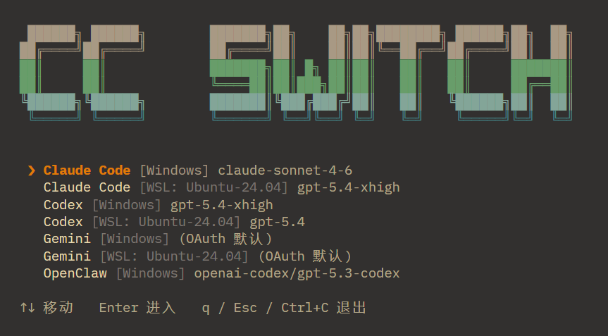

<div align="center">

<h1>CC Switch CLI</h1>
</div>

## Install

**WSL / Linux / macOS**
```bash
curl -fsSL https://raw.githubusercontent.com/OpenCils/cc-switch-cli/main/install.sh | bash
```

**Windows (PowerShell)**
```powershell
irm https://raw.githubusercontent.com/OpenCils/cc-switch-cli/main/install.ps1 | iex
```

After installation, type `cc` in any terminal to launch.

<p align="center"><strong>Switch models, providers, and environments for Claude Code, Codex, Gemini, and OpenClaw — all from one terminal.</strong></p>

---

<div align="center">

**[English](./README.md) | [中文](./README.zh.md) | [日本語](./README.ja.md) | [한국어](./README.ko.md)**


</div>

## What it does

When you're juggling multiple AI coding tools, the pain isn't the models themselves — it's scattered config files:

- Claude Code wants `settings.json`
- Codex wants `config.toml`
- Gemini and OpenClaw each have their own format
- Windows and WSL are often two completely separate worlds

`CC Switch CLI` pulls all of that into one terminal interface. You pick an installation, pick a provider, hit Enter — it handles the config writes and proxy lifecycle.

## Features

| Feature | Description |
| --- | --- |
| Multi-tool switching | Supports Claude Code, Codex, Gemini, OpenClaw |
| Multi-environment detection | Scans Windows, native Linux/macOS, and WSL distros |
| Native config write-back | Writes to `settings.json`, `config.toml`, `openclaw.json` per tool |
| Provider management | Store multiple provider configs per installation, track the active one |
| ATO proxy | Bridges Claude Code to OpenAI-compatible APIs — auto start/stop, port conflict avoidance, background persistence |
| Exit governance | Explicitly choose to keep ATO running in the background or shut it down on exit |

## Usage

1. The first screen lists all detected installations — e.g. `Claude Code [Linux]` or `Codex [WSL: Ubuntu-24.04]`
2. Enter an installation to manage its provider list
3. Activating a provider writes the model, base URL, and API key back to that tool's native config
4. If the provider has ATO enabled, CC Switch manages the proxy port and process lifecycle automatically
5. On exit, choose to keep ATO running in the background or shut everything down

## Keyboard shortcuts

| Screen | Key | Action |
| --- | --- | --- |
| Entry screen | `↑` / `↓` | Move cursor |
| Entry screen | `Enter` | Enter installation |
| Entry screen | `q` / `Esc` | Open exit confirmation |
| Global | `Ctrl+C` | Open exit confirmation |
| Form screen | `Tab` / `Shift+Tab` | Switch fields |
| Form screen | `Enter` | Next field or submit |
| Form screen | `Ctrl+S` | Save |
| Form screen | `Esc` | Cancel |

## How ATO works

When a provider has `Via ATO Proxy` enabled, CC Switch will:

1. Point Claude Code at the local ATO port
2. Translate Anthropic-style requests into OpenAI Responses API format
3. Translate responses back into Anthropic format
4. Run the proxy as a detached process so it survives the TUI exiting

Default port is `18653`. If that port is occupied, CC Switch scans for the next available port and persists it.

## Config files

| Location | Purpose |
| --- | --- |
| `~/.cc-switch.json` | CC Switch's own provider store and active state |
| Tool-native config files | Written on provider activation |
| `~/.cc-switch-ato/` | ATO process records |

## Run from source

```bash
git clone https://github.com/OpenCils/cc-switch-cli.git
cd cc-switch-cli
npm install
npm start
```

## Status

- Distributed as precompiled standalone binaries via GitHub Releases — no Node.js or npm required
- Supports Linux x64, macOS ARM64, Windows x64
- Terminal UI built on `Ink`, not a web panel
