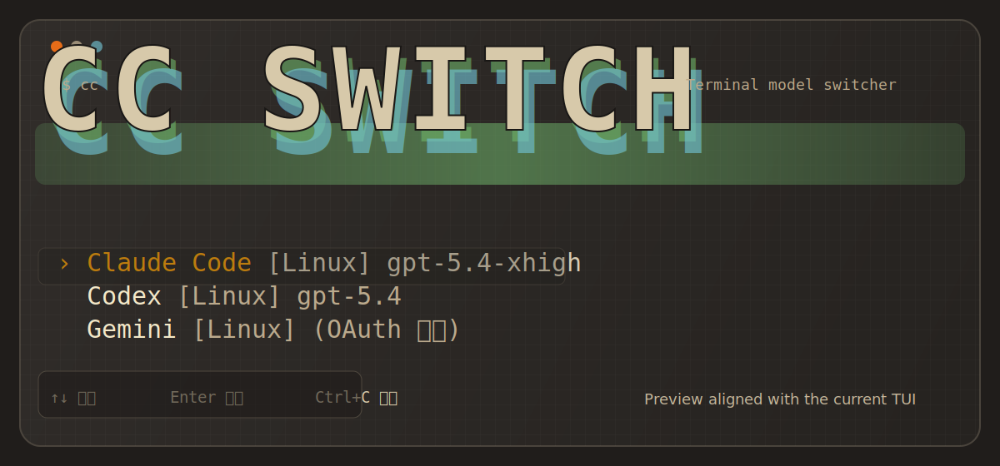

<div align="center">
  
  <h1>CC Switch CLI</h1>
  <p>在一个终端里切换 Claude Code、Codex、Gemini、OpenClaw 的模型、供应商与运行环境。</p>
  <p>
    
    
    
    
  </p>
</div>

<p align="center">
  它不是另一个配置文件编辑器。它会先发现安装实例，再按工具和环境维度切换供应商，并在需要时自动拉起 ATO 代理。
</p>

## 这项目干什么

当你同时在用多个 AI 编码工具，最烦的不是模型本身，而是到处改配置文件：

- Claude Code 改 `settings.json`
- Codex 改 `config.toml`
- Gemini 和 OpenClaw 又各有各的写法
- Windows 和 WSL 还经常是两套世界

`CC Switch CLI` 把这些碎片收拢进一个终端界面里。你只管选安装实例、选供应商、按下回车，剩下的配置写回和代理进程管理交给它。

## 核心能力

| 能力 | 说明 |
| --- | --- |
| 多工具切换 | 支持 Claude Code、Codex、Gemini、OpenClaw |
| 多环境检测 | 扫描 Windows、本机 Linux/macOS，以及 WSL 发行版中的安装实例 |
| 原生配置写回 | 按工具适配写入 `settings.json`、`config.toml`、`openclaw.json` |
| 供应商管理 | 为每个安装实例保存多组供应商配置，并维护当前激活项 |
| ATO 代理 | 为 Claude Code 桥接 OpenAI 兼容接口，自动启停、自动避让端口、可后台驻留 |
| 退出治理 | 退出时显式决定保留后台 ATO，还是一并关闭 |

## 快速开始

```bash
npm install
npm start
```

也可以直接运行入口：

```bash
node bin/cc.mjs
```

如果你希望把它挂成命令：

```bash
npm link
cc
```

## 交互方式

1. 首屏列出检测到的安装实例，例如 `Claude Code [Linux]` 或 `Codex [WSL: Ubuntu-24.04]`
2. 进入某个实例后，管理该实例名下的供应商列表
3. 激活供应商时，CC Switch 会把模型、地址、密钥写回对应工具原生配置
4. 如果该供应商启用了 ATO，程序会自动处理代理端口与进程生命周期
5. 退出时可选择保留 ATO 后台运行，或统一关闭

## 键盘操作

| 屏幕 | 按键 | 动作 |
| --- | --- | --- |
| 入口屏 | `↑` / `↓` | 移动光标 |
| 入口屏 | `Enter` | 进入安装实例 |
| 入口屏 | `q` / `Esc` | 打开退出确认 |
| 全局 | `Ctrl+C` | 打开退出确认 |
| 表单屏 | `Tab` / `Shift+Tab` | 切换字段 |
| 表单屏 | `Enter` | 下一字段或提交 |
| 表单屏 | `Ctrl+S` | 保存 |
| 表单屏 | `Esc` | 取消 |

## ATO 是怎么接进去的

当供应商配置启用 `通过 ATO 代理` 时，CC Switch 会：

1. 把 Claude Code 指向本地 ATO 端口
2. 将 Anthropic 风格请求转换成 OpenAI Responses API
3. 把响应再转换回 Anthropic 格式
4. 以独立进程运行代理，避免主 TUI 退出后中断会话

默认端口是 `18653`。如果端口已被占用，程序会自动顺延扫描空闲端口，并把最终端口写回本地存储。

## 配置文件

| 位置 | 用途 |
| --- | --- |
| `~/.cc-switch.json` | CC Switch 自己的供应商存储与激活状态 |
| 工具原生配置文件 | 激活供应商时写回模型、地址和密钥 |
| `~/.cc-switch-ato/` | ATO 进程记录 |

## 项目结构

```text
.
├─ bin/
│  └─ cc.mjs
├─ src/
│  ├─ app.tsx
│  ├─ types.ts
│  ├─ components/
│  │  └─ Banner.tsx
│  ├─ screens/
│  │  ├─ ProviderSelect.tsx
│  │  ├─ ProviderList.tsx
│  │  ├─ ProviderForm.tsx
│  │  └─ ExitConfirm.tsx
│  ├─ store/
│  │  ├─ detect.ts
│  │  ├─ local.ts
│  │  ├─ write-wsl.ts
│  │  └─ adapters/
│  └─ ato/
│     ├─ convert.ts
│     ├─ response.ts
│     ├─ server.ts
│     ├─ manager.ts
│     └─ entry.mjs
├─ preview.svg
└─ README.md
```

## 适合谁

- 同时使用多个 AI 编码 CLI，需要频繁切模型的人
- Windows + WSL 混合工作流用户
- 想把 Claude Code 接到 OpenAI 兼容模型上的人
- 不想再手改多份配置文件的人

## 现状

- 当前仓库以源码运行方式为主，还没有发布 npm 包
- 界面基于 `Ink` 渲染，适合终端环境，不是 Web 面板
- 预览图使用仓库内置的 `preview.svg`，GitHub 首页可直接展示
